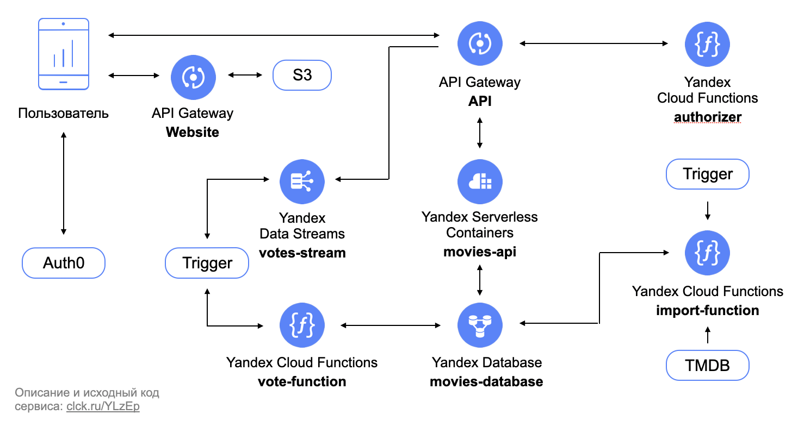

# Практикум "Разработка serverless-приложения в Yandex Cloud"

## Описание

В рамках практической работы вы пройдете полноценный путь разработки serverless-приложения с использованием современных
инструментов и сервисов. Вам предстоит создать небольшой, но функциональный сервис фильмов на языке typescript и
платформе Node.js и развернуть его в Яндекс.Облаке.

На протяжении всей работы вы не столкнетесь ни разу с такими терминами как виртуальная машина или сервер!

## Инструменты

Перед тем как начать практическую работу вам необходимо установить и настроить следующие инструменты:

- WebStorm(или любая другая среда разработки с поддержкой typescript)
- Git
- Typescript
- Node.js
- Docker
- Yandex Cloud CLI(yc)
- Terraform
- Amazon Web Services(AWS) CLI

Подробное описание того, как это сделать, приведено [здесь](ENVIRONMENT.md).

## Архитектура приложения



## Содержание практикума

1. [Начало работы](#begin)
2. [Создание базы данных](#database)
3. [Реализация CRUD-операций](#crud)
4. [Разработка REST API](#rest)
5. [Импорт фильмов и картинок](#import)
6. [Аутентификация и авторизация](#authorization)
7. [Проставление оценок и подсчет рейтинга](#ratings)
8. [Веб-интерфейс](#website)

<div id="begin"/>

### Начало работы

1. Скачайте проект из git-репозитория и откройте его в WebStorm:

```bash
git clone <ссылка на репозиторий>
```

2. Выполните команду:

```bash
yc config profile get <имя профиля>
```

3. Скопируйте из вывода идентификаторы облака, каталога и oauth-токен и вставьте их в
   файл [provider.tf](deploy/provider.tf) в соответствующие поля. А также экспортируйте идентификатор каталога в
   переменную окружения:

```bash
export FOLDER_ID=<идентификатор каталога>
echo $FOLDER_ID
```

4. Выполните в терминале команду инициализации terraform из-под директории `deploy`:

```bash
cd deploy
terraform init
``` 

В дальнейшем все команды `terraform` необходимо выполнять из-под каталога `deploy`.

<div id="database"/>

### Создание базы данных

Веб-приложения можно проектировать и разрабатывать сверху вниз или снизу вверх. Это спорная тема, но мы остановимся на
втором подходе. А это означает, что вначале нам надо придумать схему или модель хранения наших данных, после этого
определиться с СУБД, а затем создать базу данных приложения и соответствующие нашей схеме таблицы. В арсенале
serverless-стека Яндекс.Облака имеется Yandex Database со специальным serverless-режимом работы. Ее мы и будем
использовать здесь. Для веб-приложения потребуются две таблицы: `movies` для хранения фильмов и `votes`
для хранения оценок пользователей. Каждая запись в таблице `movies` будет содержать идентификатор фильма и конечный
набор аттрибутов, аналогично с оценками. Раз мы определились со схемой и СУБД, давайте создадим базу данных:

1. В файле [ydb.tf](deploy/ydb.tf) описана конфигурация необходимой для хранения фильмов базы данных Yandex Database.
   Для ее развертывания в Яндекс.Облаке выполните команду:

```bash
terraform apply -target=yandex_ydb_database_serverless.movies_database
```

После завершения команды в вашем каталоге будет создана база данных `movies-database`. В консоли в
переменной `movies_database_document_api_endpoint` будет напечатан ее эндпоинт, а в переменной `movies_database_path` -
относительный путь. Экспортируйте эти значения в переменные окружения:

```bash
export DOCUMENT_API_ENDPOINT=<movies_database_document_api_endpoint>
echo $DOCUMENT_API_ENDPOINT
export MOVIES_DATABASE_PATH=<movies_database_path>
echo $MOVIES_DATABASE_PATH
```

2. Чтобы создать таблицы, выполните команды, приведенные ниже:

```bash
aws dynamodb create-table \
    --table-name movies \
    --attribute-definitions \
      AttributeName=id,AttributeType=N \
      AttributeName=title,AttributeType=S \
      AttributeName=type,AttributeType=S \
      AttributeName=original_title,AttributeType=S \
      AttributeName=original_language,AttributeType=S \
      AttributeName=release_date,AttributeType=S \
      AttributeName=poster_path,AttributeType=S \
      AttributeName=popularity,AttributeType=N \
      AttributeName=video,AttributeType=S \
      AttributeName=vote_count,AttributeType=N \
      AttributeName=vote_average,AttributeType=N \
      AttributeName=genres,AttributeType=S \
      AttributeName=backdrop_path,AttributeType=S \
      AttributeName=adult,AttributeType=S \
      AttributeName=overview,AttributeType=S \
    --key-schema \
      AttributeName=id,KeyType=HASH \
    --global-secondary-indexes \
        "[
            {
                \"IndexName\": \"PopularityIndex\",
                \"KeySchema\": [{\"AttributeName\":\"type\",\"KeyType\":\"HASH\"}, {\"AttributeName\":\"popularity\",\"KeyType\":\"RANGE\"}],
                \"Projection\":{
                    \"ProjectionType\":\"ALL\"
                }                
            }
        ]" \
    --endpoint ${DOCUMENT_API_ENDPOINT}

aws dynamodb create-table \
    --table-name votes \
    --attribute-definitions \
      AttributeName=id,AttributeType=S \
      AttributeName=user_id,AttributeType=S \
      AttributeName=movie_id,AttributeType=N \
      AttributeName=value,AttributeType=N \
    --key-schema \
      AttributeName=id,KeyType=HASH \
    --global-secondary-indexes \
        "[
            {
                \"IndexName\": \"MovieIndex\",
                \"KeySchema\": [{\"AttributeName\":\"movie_id\",\"KeyType\":\"HASH\"}],
                \"Projection\":{
                    \"ProjectionType\":\"ALL\"
                }                
            }
        ]" \
    --endpoint ${DOCUMENT_API_ENDPOINT}
```

Чтобы проверить, что таблицы создались, можно выполнить команду `describe-table` как показано ниже:

```bash
aws dynamodb describe-table --table-name movies --endpoint ${DOCUMENT_API_ENDPOINT}
aws dynamodb describe-table --table-name votes --endpoint ${DOCUMENT_API_ENDPOINT}
```

Обратите внимание, что для таблицы `movies` необходимо поддерживать два индекса. Первый индекс для быстрого поиска
фильма по его идентификатору, а второй - для сортировки фильмов по популярности. Аналогично для таблицы `votes` у нас
будет два индекса: один для поиска оценки конкретного пользователя по конкретному фильму, другой для получения всех
оценок фильма.

<div id="crud"/>

### Реализация CRUD-операций

Практически каждое приложение или сервис имеет свой слой работы с данными или базой данных. Этот слой мы будем
использовать при реализации сервиса каждый раз, когда нам необходимо будет создавать, получать, обновлять или удалять
фильмы и оценки. Эти операции еще обычно называют CRUD-операциями. В качестве API для работы с базой данных будем для
простоты использовать AWS DynamoDB Document API, а именно
библиотеку [AWS SDK for JavaScript v3](https://docs.aws.amazon.com/AWSJavaScriptSDK/v3/latest/index.html), его
реализующую. В файле [model.ts](src/model.ts) через интерфейс typescript определены модели фильма `Movie` и
оценки `Vote`. В файле [repository.ts](src/repository.ts) реализованы основные CRUD-операции для работы с этими
сущностями. Обратите внимание, что для авторизации при выполнении этих операций используются IAM-токены, выписываемые
для сервисного аккаунта, который мы создадим позже. Для получения IAM-токена перед выполнением операции
вызывается [сервис метаданных](https://cloud.yandex.ru/docs/serverless-containers/operations/sa). В этом разделе вы
установите необходимы зависимости и скомпилируете javascript код.

1. Установите необходимые зависимости, выполнив команду из корня проекта:

```bash
npm ci
```

После выполнения команды в проекте появится директория `node_modules`, в которой будут находиться все необходимые
зависимости.

2. Запустите сборку проекта:

```bash
npm run build
```

После выполнения команды в проекте появится директория `dist`, в которой будут находиться скомпилированные js-файлы.
<div id="rest"/>

### Разработка REST API

Ключевым компонентом практически любого современного веб-сервиса является его REST API(учитываем, что пока
еще подавляющее большинство приложений используют именно REST-подход при реализации своего API). При его разработке
важно понимать, какие у вашего приложения будут сценарии использования и на каких клиентских платформах(
веб/мобильные/тв и т.д.) они будут реализовываться. В нашем случае мы сделаем простой веб-интерфейс, в котором будет
страница со списком фильмов и страница с детальной информацией про фильм. В файле [openapi/api.yaml](openapi/api.yaml)
уже подготовлена OpenAPI-спецификация REST-сервиса. Обратите внимание на то, что там описаны основные операции работы с
фильмами и оценками. Для реализации сервиса в соответствии с этой спецификацией будем использовать
библиотеку [openapi-backend](https://github.com/anttiviljami/openapi-backend) в связке с
фреймворком [express](https://expressjs.com). В файле [app.ts](src/app.ts) инициализируются необходимые классы,
прописывается маппинг операций и запускается http-сервис. Приложение будет собираться в виде docker-образа и
разворачиваться в [Serverless Containers](https://cloud.yandex.ru/services/serverless-containers). Последовательно
пройдите все шаги, необходимые для развертывания REST API:

1. Для начала создайте сервисный аккаунт `movies-api-sa`, от которого будет работать приложение. Его описание приведено
   в файле [sa.tf](deploy/sa.tf). Чтобы сделать это, выполните в консоли команду:

```bash
terraform apply -target=yandex_iam_service_account.movies_api_sa
```

В выводе команды в переменной `movies_api_sa_id` вы увидите идентификатор созданного сервисного аккаунта. Добавим его в
переменную окружения:

```bash
export MOVIES_API_SA_ID=<movies_api_sa_id>
echo $MOVIES_API_SA_ID
```

Сервисный аккаунт будет использоваться приложением для следующих целей:

* вызова контейнера в [Serverless Containers](https://cloud.yandex.ru/services/serverless-containers),
* выполнения операций к базе данных в [Yandex Database](https://cloud.yandex.ru/services/ydb)
* вызова функции в [Cloud Functions](https://cloud.yandex.ru/services/functions)
* работы c [Object Storage](https://cloud.yandex.ru/services/storage)
* записи в поток [Yandex DataStreams](https://cloud.yandex.ru/services/data-streams)

Чтобы выполнять эти действия, выдадим этому сервисному аккаунту необходимые роли (для простоты выдадим роли на весь
каталог, а не на каждый ресурс в отдельности). Для этого последовательно выполните следующие команды:

```bash
yc resource-manager folder add-access-binding ${FOLDER_ID} --role ydb.admin --subject serviceAccount:${MOVIES_API_SA_ID}
yc resource-manager folder add-access-binding ${FOLDER_ID} --role container-registry.images.puller --subject serviceAccount:${MOVIES_API_SA_ID}
yc resource-manager folder add-access-binding ${FOLDER_ID} --role serverless.containers.invoker --subject serviceAccount:${MOVIES_API_SA_ID}
yc resource-manager folder add-access-binding ${FOLDER_ID} --role serverless.functions.invoker --subject serviceAccount:${MOVIES_API_SA_ID}
yc resource-manager folder add-access-binding ${FOLDER_ID} --role storage.editor --subject serviceAccount:${MOVIES_API_SA_ID}
yc resource-manager folder add-access-binding ${FOLDER_ID} --role yds.admin --subject serviceAccount:${MOVIES_API_SA_ID}
```

Пропишите идентификатор сервисного аккаунта, созданного выше, в начале спецификации [openapi/api.yaml](openapi/api.yaml)
в поле `x-yc-apigateway.service_account_id`.

2. Теперь создайте реестр и репозиторий docker-образов
   в [Container Registry](https://cloud.yandex.ru/services/container-registry), куда будет выкладываться образ
   приложения. Необходимые ресурсы описаны в файле [container-registry.tf](deploy/container-registry.tf). Для этого
   выполните команды:

```bash
terraform apply -target=yandex_container_registry.default
terraform apply -target=yandex_container_repository.movies_api_repository
```

В выводе команды в переменной `movies_api_repository_name` вы увидите название репозитория, которое ниже будет
использоваться при загрузке образа. Экспортируйте его в переменную окружения:

```bash
export MOVIES_API_REPOSITORY_NAME=<movies_api_repository_name>
echo $MOVIES_API_REPOSITORY_NAME
```

Далее сконфигурируйте docker для работы с только что созданным репозиторием с помощью команды:

```bash
yc container registry configure-docker
```

3. Соберите docker-образ приложения(файл конфигурации docker-образа традиционно называется [Dockerfile](Dockerfile)) и
   загрузите его в созданный на предыдущем шаге репозиторий. Для этого выполните последовательно следующие команды из
   корня проекта:

```bash
docker build -t ${MOVIES_API_REPOSITORY_NAME}:0.0.1 .
docker push ${MOVIES_API_REPOSITORY_NAME}:0.0.1
```

4. Создайте serverless-контейнер, который будет запускаться из выше созданного образа:

```bash
yc sls container create --name movies-api-container --folder-id ${FOLDER_ID}
```

В выводе команды вы увидите идентификатор созданного контейнера, экспортируйте его в переменную окружения:

```bash
export MOVIES_API_CONTAINER_ID=<идентификатор контейнера>
echo $MOVIES_API_CONTAINER_ID
```

Разверните ревизию контейнера с версией образа `0.0.1`:

```bash
yc sls container revisions deploy \
	--folder-id ${FOLDER_ID} \
	--container-id ${MOVIES_API_CONTAINER_ID} \
	--memory 512M \
	--cores 1 \
	--execution-timeout 5s \
	--concurrency 4 \
	--environment AWS_ACCESS_KEY_ID=FAKE_AWS_ACCESS_KEY_ID,AWS_SECRET_ACCESS_KEY=FAKE_AWS_SECRET_ACCESS_KEY,DOCUMENT_API_ENDPOINT=${DOCUMENT_API_ENDPOINT} \
	--service-account-id ${MOVIES_API_SA_ID} \
	--image ${MOVIES_API_REPOSITORY_NAME}:0.0.1
```

Обратите внимание на то, что мы сконфигурировали параметр concurrency, для того что бы один запущенный экземпляр
serverless-контейнера мог конкурентно обрабатывать несколько запросов. Также обратите внимание, что мы через переменную
окружения `DOCUMENT_API_ENDPOINT` передаем внутрь нашего приложения эндпоинт базы данных.

5. Чтобы сервис полноценно заработал и был доступен из интернета, необходимо
   развернуть [API Gateway](https://cloud.yandex.ru/services/api-gateway). Замените `${MOVIES_API_CONTAINER_ID}` на
   идентификатор созданного контейнера во всех интеграциях в спецификации [openapi.yaml](openapi/api.yaml). В
   файле [api-gateway.tf](deploy/api-gateway.tf) сконфигурирован API-шлюз, реализующий спецификацию. Для того чтобы
   создать его в облаке выполните команду:

```bash
terraform apply -target=yandex_api_gateway.movies_api_gateway
```

В выводе команды в переменной `movies_api_gateway_domain` вы увидите доменное имя, на котором развернут созданный
API-шлюз. Экспортируйте его в переменную окружения:

```bash
export MOVIES_API_GATEWAY_DOMAIN=<movies_api_gateway_domain>
echo $MOVIES_API_GATEWAY_DOMAIN
```

6. Проверим работу развернутого сервиса. Для этого сделаем http-запрос с помощью команды `curl`:

```bash
curl "${MOVIES_API_GATEWAY_DOMAIN}/movies?limit=10"
```

В ответе должен прийти пустой список `[]`, так как пока никаких данных в базе нет. Также вы можете загрузить
спецификацию в [Postman](https://www.postman.com) или [SwaggerHub](https://swagger.io/tools/swaggerhub/), добавив в нее
в секцию `servers` адрес созданного API-шлюза из переменной `${MOVIES_API_GATEWAY_DOMAIN}`. Это позволит вам удобно
делать вызовы к REST API.

Зайдите в веб-консоль на страницу serverless-контейнера и в разделе `Логи` вы увидите сообщение, соответствующее вызову.
Также вы можете зайти в раздел `Мониторинг` и увидеть вызов на графиках. Аналогично на странице API-шлюза вы можете
посмотреть логи и графики вызовов в соответствующих разделах.
<div id="import"/>

### Импорт фильмов и картинок

Наполнением любого сайта или веб-приложения является его контент. Контентом нашего приложения являются данные о фильмах.
В этом разделе мы научим наше приложение импортировать данные из других источников. Как вы знаете даже
[Кинопоиск](https://www.kinopoisk.ru) изначально был всего лишь парсером [IMDB](https://www.imdb.com). Мы же наполним
наше приложение данными из открытой базы фильмов [TMDB](https://www.themoviedb.org). Для этого разработаем функцию
импорта данных и настроим триггер по расписанию, который будет запускать эту функцию. Чтобы не заставлять вас
регистрироваться в TMDB и получать api-ключ, мы уже это сделали заранее и выгрузили в Object Storage файл в формате
json [tmdb.json](https://storage.yandexcloud.net/movies-app/tmdb.json) с необходимыми данными. Будем считать, что этот
файл обновляется с какой-то периодичностью. Нашему приложению всего лишь необходимо регулярно забирать его, читать и
обновлять информацию о фильмах в базе данных. В файле [import.ts](src/import.ts) уже написан код функции, выполняющий
эту задачу. Вместе с загрузкой данных в `movies-database` эта функция скачивает файлы постеров и заставок фильмов и
кладет их в отдельный бакет в Object Storage. Веб-интерфейс приложения будет для каждого фильма показывать его постер и
заставку, загружая их из этого бакета.

1. Cоздайте бакет в Object Storage. Необходимая конфигурация описана в
   файле [object-storage.tf](deploy/object-storage.tf). Для применения конфигурации выполните команду:

```
terraform apply -target=yandex_storage_bucket.movies_images_bucket
```

В выводе команды в переменной `movies_images_bucket` будет напечатано имя бакета. Сохраните его в переменной окружения:

```bash
export MOVIES_IMAGES_BUCKET=<movies_images_bucket>
echo $MOVIES_IMAGES_BUCKET
```

2. Теперь разверните функцию импорта, необходимая конфигурация приведена в
   файле [import-function.tf](deploy/import-function.tf). Функция будет запускаться на
   nodejs-рантайме `nodejs16-preview`, в котором существенно уменьшено время холодного старта. Обратите внимание на
   переменные окружения в параметре `environment`, среди них есть `IMAGES_BUCKET_NAME` - имя созданного выше бакета, в
   который функция будет загружать изображения. Соберем и запакуем код функции в zip-архив, а потом развернем ее,
   выполнив следующие команды из-под корня проекта:

```bash
npm run package-import && cd deploy
terraform apply -target=yandex_function.import_function
```

3. Теперь настройте триггер, который будет запускать функцию импорта по расписанию. Триггер как и функция уже
   сконфигурирован в файле [import-function.tf](deploy/import-function.tf). Обратите внимание на крон-выражение в
   параметре `cron_expression`, согласно которому функция будет запускаться раз в час. Для создания и запуска триггера
   достаточно выполнить команду:

```bash
terraform apply -target=yandex_function_trigger.import_trigger
```

4. Запустите функцию и подождите пока она отработает, а затем снова сделайте запрос к REST API:

```bash
yc sls function invoke --name import-function
# {"statusCode":200,"body":"Imported 100 movies from TMDB","isBase64Encoded":false}
curl "${MOVIES_API_GATEWAY_DOMAIN}/movies?limit=10"
```

В ответе вы увидите массив json-объектов с фильмами, которые были загружены в базу данных.

<div id="authorization"/>

### Аутентификация и авторизация

Для реализации механизма аутентификации и авторизации в приложении воспользуемся сервисом [Auth0](https://auth0.com) и
возможностью подключать
специальную [функцию-авторайзер](https://cloud.yandex.ru/docs/api-gateway/concepts/extensions/function-authorizer) к API
Gateway. Мы заранее создали и настроили необходимые ресурсы в auth0, а также
написали [код авторайзера](src/authorizer.ts). Авторайзер получает из заголовка `Authorization` JWT-токен, верифицирует
его, декодирует и проверят наличие у пользователя роли и соответствующих прав, необходимых для выполнения операции. Нам
осталось только задеплоить авторайзер и подключить его к API-шлюзу. В OpenAPI-спецификации уже описана требуемая нам
схема безопасности. Мы дополним ее специальным расширением, чтобы API-шлюз смог вызвать авторизационную функцию.

1. Конфигурация авторайзера описана в файле [deploy/authorizer.tf](deploy/authorizer.tf). Создайте zip-архив с функцией
   и примените конфигурацию, выполнив следующие команды:

```bash
npm run package-authorizer && cd deploy
terraform apply -target=yandex_function.authorizer
```

В выводе команды в переменной `authorizer_function_id` будет напечатан идентификатор функции-авторайзера.

2. Раскомментируйте расширение `securitySchemes.httpBearerAuth.x-yc-apigateway-authorizer` в
   конце [спецификации](openapi/api.yaml) API-шлюза. Скопируйте полученный на предыдущем шаге идентификатор
   авторайзера `authorizer_function_id` и вставьте его вместо переменной `${AUTHORIZER_FUNCTION_ID}`
   в поле `securitySchemes.httpBearerAuth.x-yc-apigateway-authorizer.function_id`. Также раскомментируйте security секцию во
   всех операциях спецификации, где она есть:
```yaml
      security:
        - httpBearerAuth: [ ]
```
3. Обновите спецификацию API-шлюза:

```bash
terraform apply -target yandex_api_gateway.movies_api_gateway
```

Теперь, если сделать http-вызов к сервису `curl "${MOVIES_API_GATEWAY_DOMAIN}/movies?limit=10"`, то будет получен
ответ `{"message":"Unauthorized"}` с http-кодом 401.

<div id="ratings"/>

### Проставление оценок и подсчет рейтинга

Добавим возможность оценивать фильмы и на основе оценок считать их рейтинг. В качестве исходных значений рейтинга
возьмем данные из TMDB. Мы уже импортируем их и сохраняем в базе с помощью функции импорта. При проставлении оценки
пользователем через веб-интерфейс в API-шлюз будет отправляться http-запрос `postVote` с новой оценкой, гейтвей в свою
очередь после успешной авторизации будет записывать оценку в
поток [Yandex DataStreams](https://cloud.yandex.ru/services/data-streams), у него есть отдельная интеграция для этого.
Специальная функция будет срабатывать по триггеру на каждое сообщение из потока и сохранять оценку в базу данных в
таблицу `votes`, а также пересчитывать и обновлять в базе рейтинг фильма. Проставленную пользователем оценку
веб-интерфейс будет получать с помощью операции `getVote`, которая ранее уже была добавлена в REST API.

1. Создайте новый поток с двумя шардами:

```bash
aws kinesis create-stream \
  --endpoint https://yds.serverless.yandexcloud.net \
  --stream-name ${MOVIES_DATABASE_PATH}/votes-stream \
  --shard-count 2
```

2. Функция проставления оценки и подсчета рейтинга реализована в файле [src/vote.ts](src/vote.ts). Создайте zip-архив с
   функцией и разверните ее с помощью terraform конфигурации [deploy/vote-function.tf](deploy/vote-function.tf):

```bash
npm run package-vote && cd deploy
terraform apply -target yandex_function.vote_function
```

В выводе команды в переменной `vote_function_id` будет напечатан идентификатор созданной функции. Сохраните его в переменной окружения:

```bash
export VOTE_FUNCTION_ID=<vote_function_id>
echo $VOTE_FUNCTION_ID
```

3. Создайте триггер, который будет слушать поток и вызывать функцию проставления оценки. Для этого
   необходимо выполнить команду:

```bash
yc sls trigger create yds \
	--name vote-trigger \
	--database ${MOVIES_DATABASE_PATH} \
	--stream votes-stream \
	--stream-service-account-id ${MOVIES_API_SA_ID} \
	--batch-size 1024b \
	--invoke-function-id ${VOTE_FUNCTION_ID} \
	--invoke-function-service-account-id ${MOVIES_API_SA_ID} \
	--retry-attempts 3 \
	--retry-interval 10s
```

4. Для проставления оценки в спецификацию добавлена операция `postVote` со специальной интеграцией c DataStreams.
   Подставьте значение переменной `${MOVIES_DATABASE_PATH}` в аттрибут `stream_name`
   расширения `x-yc-apigateway-integration` этой операции. После этого обновите API-шлюз:

```bash
terraform apply -target=yandex_api_gateway.movies_api_gateway
```

Обратите внимание, что в качестве ключа партиционирования используется идентификатор пользователя, полученный из пути
http-запроса. Это гарантирует, что оценки пользователя будут обновляться в системе в том же порядке, в котором он их
проставлял.

<div id="website"/>

### Веб-интерфейс

Веб-интерфейс приложения представляет из себя SPA и находится в директории [web](web) проекта. Загрузим всю
директорию [web](web) в отдельный бакет и развернем еще один API-шлюз над ним:

1. Создайте бакет для хранения веб-сайта:

```bash
terraform apply -target=yandex_storage_bucket.movies_website_bucket
```

В выводе команды в переменной `movies_website_bucket` будет напечатано имя созданного бакета. Экспортируйте его в
переменную окружения:

```bash
export MOVIES_WEBSITE_BUCKET=<movies_website_bucket>
echo $MOVIES_WEBSITE_BUCKET
```

2. В файле [openapi/website.yaml](openapi/website.yaml) описана спецификация API-шлюза для веб-сайта. Подставьте вместо
   переменных `${movies_website_bucket}`, `${movies_images_bucket}` и `${movies_api_sa_id}` их значения, скопировав из
   вывода команды, выполненной на предыдущем шаге. Создайте API-шлюз с
   конфигурацией [deploy/website-gateway.tf](deploy/website-gateway.tf), выполнив команду:

```bash
terraform apply -target=yandex_api_gateway.movies_website_gateway
```

В выводе команды будет напечатан адрес API-шлюза в переменной `movies_website_gateway_domain`. Экспортируйте его в
переменную окружения:

```bash
export MOVIES_WEBSITE_GATEWAY_DOMAIN=<movies_website_gateway_domain>
echo $MOVIES_WEBSITE_GATEWAY_DOMAIN
```

3. Заполните параметры конфигурации веб-сайта в файле [web/assets/config.yaml](web/assets/config.yaml), подставив
   значения переменных `${movies_website_gateway_domain}` и `${movies_api_gateway_domain}`, скопировав их из вывода
   команды, выполненной на предыдущем шаге.

4. Загрузите файлы веб-сайта в бакет:

```bash
aws --endpoint-url=https://storage.yandexcloud.net s3 cp --recursive web/ s3://${MOVIES_WEBSITE_BUCKET}
```

5. Проверьте работу приложения. Для этого зайдите на веб-сайт по адресу `echo $MOVIES_WEBSITE_GATEWAY_DOMAIN`.
   Зарегистрируйтесь и войдите в приложение, откроется список фильмов, зайдите на страницу какого-нибудь фильма и
   попробуйте поставить оценку. Нажмите назад и зайдите снова на страницу фильма, не перегружая ее, проверьте, что
   значение рейтинга изменилось, а ваша оценка отобразилась корректно. Также вы можете посмотреть в веб-консоли логи и
   графики API-шлюзов, serverless-контейнера и потока данных, чтобы убедиться, что веб-интерфейс общается именно с вашим
   сервисом.
